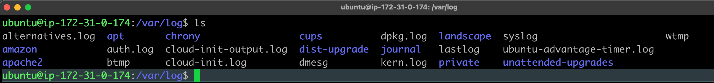
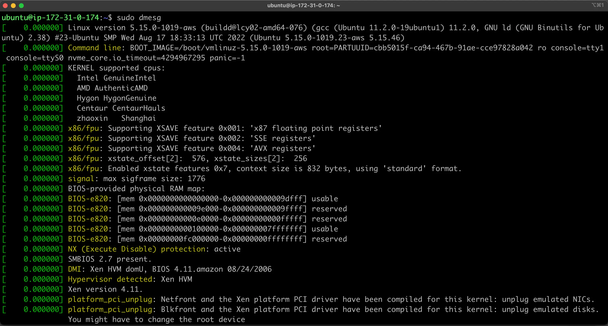
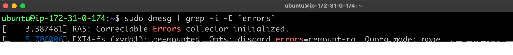

# Community | Understanding Log Files on your Linux System

### Log files in Linux represent point in time events for activity related to the OS, system devices, and applications running on the system. Learn how to leverage logs to investigate, troubleshoot issues, debug applications, and keep servers reliable at all times.

Linux systems contain a common directory structure under `/var/log` to store files for several key OS services, and applications. Contents may vary across distributions, but a typical list view of what is found inside is similar to the following,


Contents of /var/log directory

Log file entries of note include:

- **Path**: `/var/log/syslog` (Debian/Ubuntu) or `/var/log/messages` (RHEL/CentOS)
These logs capture general system events, such as startup messages, kernel events, and system activity.
- **Path**: `/var/log/auth.log` (Debian/Ubuntu) or `/var/log/secure` (RHEL/CentOS)
Authentication logs record user login and authentication events, including both successful and failed login attempts.
- **Path**: `/var/log/kern.log`
Kernel logs contain detailed information about kernel events, which can be critical for diagnosing hardware or driver issues.
- **Path**:` /var/log/boot.log`
Records information about services and processes that start during boot. Helpful for identifying boot-time errors and tracking service initialization.
- **Path**: `/var/log/cron` stores information about `cron` jobs which are tasks configured to run on a set schedule. An example would be an operation that runs every **Sunday at 4:00AM** to perform data backups. The information captured in the cron log verifies if a task runs as scheduled as well as the output results from the job.
- **Path**: `/var/log/lastlog` 
A binary file that records the last login time for each user. You can view its contents using the `lastlog` command
 - **Path**: `/var/log/btmp`
Logs all failed login attempts, useful for identifying brute-force attacks. View this file with the `lastb` command(you can use `last -f `to specify other file).
- **Path**: `/var/log/wtmp`
This binary file logs all login and logout events, tracking user sessions over time. It records details such as the username, terminal, IP address, and timestamps of logins and logouts. View the contents using the `last` command(you can use `last -f `to specify other file).
-**Path**:` /var/run/utmp`
Contains information about currently logged-in users. Access it with commands like `who` and `w` (you can use `last -f `to specify other file).
- **Path**: `/var/log/audit/audit.log`
The Linux Audit framework’s binary logs track security-related events, such as access control violations and system calls


Applications developed to run on Linux can also create logs as evidenced by several sub-directories in the graphic above. Print services write logs to the `./cups` sub-directory, and information captured by web servers is written to `./apache2`. Developers simply modify the code so that output is written to a location most suited for the application. As a best practice, developers can use a unique sub-directory to manage logs associated with each application. 

Syslog is used for generating message logs and has been the standard on Linux systems for years. Recently, distributions have been updated to ship with journald, a utility used in conjunction with syslog for collecting and storing message data. The concept of syslog can be easily broken down into the following components:

1.  The syslog *protocol* [RFC 5424](https://tools.ietf.org/html/rfc5424), which is a transport protocol that specifies how to transmit logs over the network. It is also the data format that defines the structure of a message. By default, syslog uses ports `514` for plaintext and `6514` to encrypt messages requiring additional security.
    
2.  The syslog *daemon* process, for receiving and processing system messages. It listens for events through `/dev/log`, where applications write message details. Because of its flexibility, the daemon can write locally to the system or to a remote server making it possible to centralize event logs across a distributed, multi-server environment. There are different implementations of syslog including [rsyslogd](https://www.rsyslog.com/) and [syslog-ng](https://www.syslog-ng.com/).
    
3.  The syslog *message*, which is an event record structured using the syslog [message format](https://tools.ietf.org/html/rfc5424#section-6). A message is comprised of a standard header and body containing complete details about an event.
    

Because syslog is able to forward messages to remote servers, it can send critical events to 3rd-party management platforms like SolarWinds and New Relic, or to analytics tools like OpenSearch/Splunk. Inside of these applications, data is stored, aggregated and visualized for further reporting and analysis.

The dmesg utility examines kernel-related messages generated from the kernel ring buffer on a system. This component contains information about server hardware, device drivers, and a variety of modules that perform operations during system start-up. The tool is useful when diagnosing component failures or issues with connected devices.

By default, dmesg produces output as illustrated in the following image

Output from dmesg command

Using regular expressions, operators can easily query for certain log entries. For example, you can output information through dmesg that contains errors or warnings:


Error output from dmesg command

# Journalctl
Some of the most compelling advantages of systemd are those involved with process and system logging. When using other tools, logs are usually dispersed throughout the system, handled by different daemons and processes, and can be fairly difficult to interpret when they span multiple applications. systemd attempts to address these issues by providing a centralized management solution for logging all kernel and userland processes. The system that collects and manages these logs is known as the journal.

##  General idea
One of the impetuses behind the systemd journal is to centralize the management of logs regardless of where the messages are originating. Since much of the boot process and service management is handled by the systemd process, it makes sense to standardize the way that logs are collected and accessed. The journald daemon collects data from all available sources and stores them in a binary format for easy and dynamic manipulation.

This gives us a number of significant advantages. By interacting with the data using a single utility, administrators are able to dynamically display log data according to their needs. This can be as simple as viewing the boot data from three boots ago, or combining the log entries sequentially from two related services to debug a communication issue.

Storing the log data in a binary format also means that the data can be displayed in arbitrary output formats depending on what you need at the moment. For instance, for daily log management you may be used to viewing the logs in the standard syslog format, but if you decide to graph service interruptions later on, you can output each entry as a JSON object to make it consumable to your graphing service. Since the data is not written to disk in plain text, no conversion is needed when you need a different on-demand format.

The systemd journal can either be used with an existing syslog implementation, or it can replace the syslog functionality, depending on your needs. While the systemd journal will cover most administrator’s logging needs, it can also complement existing logging mechanisms. For instance, you may have a centralized syslog server that you use to compile data from multiple servers, but you also may wish to interleave the logs from multiple services on a single system with the systemd journal. You can do both of these by combining these technologies.
The journal is implemented with the journald daemon, which handles all of the messages produced by the kernel, initrd, services, etc. In this guide, we will discuss how to use the journalctl utility, which can be used to access and manipulate the data held within the journal.

# Basic Log Viewing
To see the logs that the journald daemon has collected, use the journalctl command.

When used alone, every journal entry that is in the system will be displayed within a pager (usually less) for you to browse. The oldest entries will be up top:
`journalctl`
```
Output
-- Logs begin at Tue 2015-02-03 21:48:52 UTC, end at Tue 2015-02-03 22:29:38 UTC. --
Feb 03 21:48:52 localhost.localdomain systemd-journal[243]: Runtime journal is using 6.2M (max allowed 49.
Feb 03 21:48:52 localhost.localdomain systemd-journal[243]: Runtime journal is using 6.2M (max allowed 49.
Feb 03 21:48:52 localhost.localdomain systemd-journald[139]: Received SIGTERM from PID 1 (systemd).
Feb 03 21:48:52 localhost.localdomain kernel: audit: type=1404 audit(1423000132.274:2): enforcing=1 old_en
Feb 03 21:48:52 localhost.localdomain kernel: SELinux: 2048 avtab hash slots, 104131 rules.
Feb 03 21:48:52 localhost.localdomain kernel: SELinux: 2048 avtab hash slots, 104131 rules.
Feb 03 21:48:52 localhost.localdomain kernel: input: ImExPS/2 Generic Explorer Mouse as /devices/platform/
Feb 03 21:48:52 localhost.localdomain kernel: SELinux:  8 users, 102 roles, 4976 types, 294 bools, 1 sens,
Feb 03 21:48:52 localhost.localdomain kernel: SELinux:  83 classes, 104131 rules
```
You will likely have pages and pages of data to scroll through, which can be tens or hundreds of thousands of lines long if systemd has been on your system for a long while. This demonstrates how much data is available in the journal database.

The format will be familiar to those who are used to standard syslog logging. However, this actually collects data from more sources than traditional syslog implementations are capable of. It includes logs from the early boot process, the kernel, the initrd, and application standard error and out. These are all available in the journal.

You may notice that all of the timestamps being displayed are local time. This is available for every log entry now that we have our local time set correctly on our system. All of the logs are displayed using this new information.

# Journal Filtering by Time
While having access to such a large collection of data is definitely useful, such a large amount of information can be difficult or impossible to inspect and process manually. Because of this, one of the most important features of journalctl is its filtering options.
## Displaying Logs from the Current Boot
The most basic of these which you might use daily, is the -b flag. This will show you all of the journal entries that have been collected since the most recent reboot.
`journalctl -b`
This will help you identify and manage information that is pertinent to your current environment.

In cases where you aren’t using this feature and are displaying more than one day of boots, you will see that journalctl has inserted a line that looks like this whenever the system went down:
```
Output
. . .

-- Reboot --

. . .
```
This can be used to help you logically separate the information into boot sessions.

## Past Boots
While you will commonly want to display the information from the current boot, there are certainly times when past boots would be helpful as well. The journal can save information from many previous boots, so journalctl can be made to display information easily.

Some distributions enable saving previous boot information by default, while others disable this feature. To enable persistent boot information, you can either create the directory to store the journal by typing:
`sudo mkdir -p /var/log/journal`

Or you can edit the journal configuration file:
`sudo vim /etc/systemd/journald.conf`
```
/etc/systemd/journald.conf
. . .
[Journal]
Storage=persistent
```
When saving previous boots is enabled on your server, journalctl provides some commands to help you work with boots as a unit of division. To see the boots that journald knows about, use the --list-boots option with journalctl:
`journalctl --list-boots`
```
Output
-2 caf0524a1d394ce0bdbcff75b94444fe Tue 2015-02-03 21:48:52 UTC—Tue 2015-02-03 22:17:00 UTC
-1 13883d180dc0420db0abcb5fa26d6198 Tue 2015-02-03 22:17:03 UTC—Tue 2015-02-03 22:19:08 UTC
 0 bed718b17a73415fade0e4e7f4bea609 Tue 2015-02-03 22:19:12 UTC—Tue 2015-02-03 23:01:01 UTC
 ```
 This will display a line for each boot. The first column is the offset for the boot that can be used to easily reference the boot with journalctl. If you need an absolute reference, the boot ID is in the second column. You can tell the time that the boot session refers to with the two time specifications listed towards the end.

To display information from these boots, you can use information from either the first or second column.

For instance, to see the journal from the previous boot, use the -1 relative pointer with the -b flag:
`journalctl -b -1`

## Time Windows
While seeing log entries by boot is incredibly useful, often you may wish to request windows of time that do not align well with system boots. This may be especially true when dealing with long-running servers with significant uptime.

You can filter by arbitrary time limits using the --since and --until options, which restrict the entries displayed to those after or before the given time, respectively.

The time values can come in a variety of formats. For absolute time values, you should use the following format:
`YYYY-MM-DD HH:MM:SS`
For instance, we can see all of the entries since January 10th, 2015 at 5:15 PM by typing:
`journalctl --since "2015-01-10 17:15:00"`
If components of the above format are left off, some defaults will be applied. For instance, if the date is omitted, the current date will be assumed. If the time component is missing, “00:00:00” (midnight) will be substituted. The seconds field can be left off as well to default to “00”:
`journalctl --since "2015-01-10" --until "2015-01-11 03:00"`

# Filtering by Message Interest
Above, we learned some ways that you can filter the journal data using time constraints. In this section we’ll discuss how to filter based on what service or component you are interested in. The systemd journal provides a variety of ways of doing this.
## By Unit
Perhaps the most useful way of filtering is by the unit you are interested in. We can use the -u option to filter in this way.

For instance, to see all of the logs from an Nginx unit on our system, we can type:
`journalctl -u nginx.service`
Typically, you would probably want to filter by time as well in order to display the lines you are interested in. For instance, to check on how the service is running today, you can type:
`journalctl -u nginx.service --since today`
This type of focus becomes extremely helpful when you take advantage of the journal’s ability to interleave records from various units. For instance, if your Nginx process is connected to a PHP-FPM unit to process dynamic content, you can merge the entries from both in chronological order by specifying both units:
`journalctl -u nginx.service -u php-fpm.service --since today`
This can make it much easier to spot the interactions between different programs and debug systems instead of individual processes.
# By Process, User, or Group ID
Some services spawn a variety of child processes to do work. If you have scouted out the exact PID of the process you are interested in, you can filter by that as well.

To do this we can filter by specifying the _PID field. For instance if the PID we’re interested in is 8088, we could type:
`journalctl _PID=8088`
At other times, you may wish to show all of the entries logged from a specific user or group. This can be done with the _UID or _GID filters. For instance, if your web server runs under the www-data user, you can find the user ID by typing:
`id -u www-data`
```
Output
33
```
Afterwards, you can use the ID that was returned to filter the journal results:
`journalctl _UID=33 --since today`
The systemd journal has many fields that can be used for filtering. Some of those are passed from the process being logged and some are applied by journald using information it gathers from the system at the time of the log.

The leading underscore indicates that the _PID field is of the latter type. The journal automatically records and indexes the PID of the process that is logging for later filtering. You can find out about all of the available journal fields by typing:
`man systemd.journal-fields`
## By Component Path
We can also filter by providing a path location.

If the path leads to an executable, journalctl will display all of the entries that involve the executable in question. For instance, to find those entries that involve the bash executable, you can type:
`journalctl /usr/bin/bash`
Usually, if a unit is available for the executable, that method is cleaner and provides better info (entries from associated child processes, etc). Sometimes, however, this is not possible.
## Displaying Kernel Messages
Kernel messages, those usually found in dmesg output, can be retrieved from the journal as well.

To display only these messages, we can add the -k or --dmesg flags to our command:
`journalctl -k`

`For more information use manual pages of systemd-journald and web surfing.`


